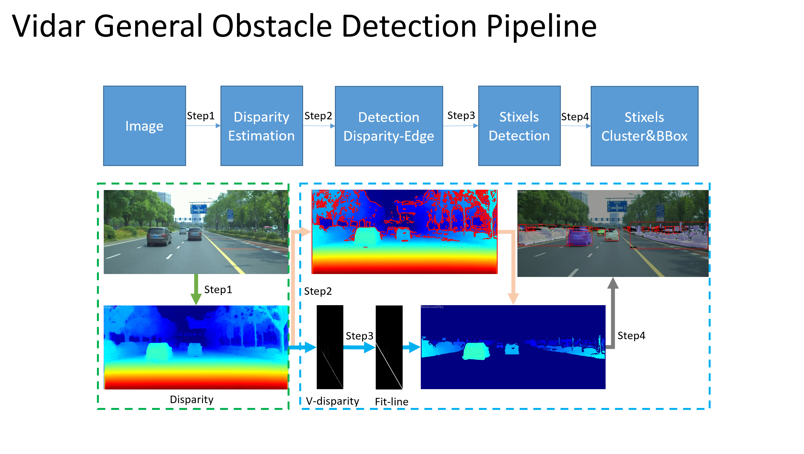

# Vidar_Obstacle_Detection
General obstacle detection for autonomous driving based on Vidar. This method can effectively solve the cases of road debris, various animals, dumped vehicles, and special-shaped vehicles, etc., in these cases, the classification-based object detection method cannot work.

##  Demo on DrivingStereo data
[HD demo](https://b23.tv/d2VFwLd)

  

## Method Introduction

  

code coming soon...
## Reference
* [StereoVisionforADAS](https://github.com/tkwoo/StereoVisionforADAS)
* [monodepth](https://github.com/mrharicot/monodepth)